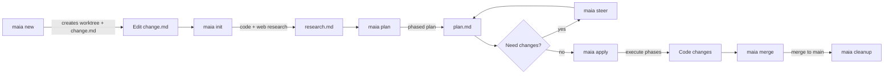

<p align="center">
  <h1 align="center">maia</h1>
  <p align="center">
    <strong>AI-powered code change planning and execution from your terminal.</strong>
  </p>
  <p align="center">
    Describe what you want. Maia researches your codebase, creates a phased implementation plan, and executes it — all in an isolated git worktree.
  </p>
</p>

<p align="center">
  <a href="#quick-start">Quick Start</a> ·
  <a href="#installation">Installation</a> ·
  <a href="#configuration">Configuration</a> ·
  <a href="#how-it-works">How It Works</a> ·
  <a href="#commands">Commands</a> ·
  <a href="#contributing">Contributing</a>
</p>

<p align="center">
  <a href="https://go.dev"></a>
  <a href="LICENSE"></a>
  <a href="https://goreportcard.com/report/github.com/sceptyre/go-maia"></a>
  <a href="https://github.com/sceptyre/go-maia/releases"></a>
</p>

---

## ✨ Features

- 🔍 **Research First** — Spends time understanding your codebase and the web before writing a single line of code
- 📋 **Plan Before Execution** — Generates a phased implementation plan with artifact tables and code samples you can review
- 🎯 **Steer the Plan** — Give feedback like *"use bcrypt, not argon2"* and the plan updates without losing context
- 🌳 **Worktree Isolation** — Every change lives in a git worktree — your main branch is never touched until you merge
- 👤 **Human in the Loop** — Review the plan, run `--dry-run`, execute phase-by-phase, or apply everything at once
- 🤖 **Orchestrator → Subagent Architecture** — A planner agent coordinates specialized code and web research agents
- 🔗 **OpenAI-Compatible** — Works with OpenAI, Azure, Ollama, LM Studio, or any OpenAI-compatible API
- 🔒 **Secret Management** — API keys support `{cmd:...}` syntax so secrets never live in plaintext

## 📖 Table of Contents

- [Features](#-features)
- [Quick Start](#-quick-start)
- [Installation](#-installation)
- [Configuration](#-configuration)
  - [Secret Management](#secret-management)
  - [Environment Variables](#environment-variables)
- [How It Works](#-how-it-works)
- [Examples](#-examples)
- [Commands](#-commands)
- [Worktree Structure](#worktree-structure)
- [Built With](#-built-with)
- [Contributing](#-contributing)
- [Security](#-security)
- [Acknowledgments](#-acknowledgments)
- [License](#-license)

## 🚀 Quick Start

```bash
# 1. Install
go install github.com/sceptyre/go-maia@latest

# 2. Configure (set your API key)
mkdir -p ~/.maia
cat > ~/.maia/config.json << 'EOF'
{
  "openai_api_key": "your-api-key",
  "model": "gpt-4"
}
EOF

# 3. Create a change request in your project
cd ~/projects/my-app
maia new "Add JWT authentication with refresh tokens"

# 4. Enter the worktree and write your goal
cd ~/.maia/worktrees/my-app/add-jwt-authentication-with-refresh-tokens/
$EDITOR .maia/change.md

# 5. Research → Plan → Execute
maia init          # AI researches your codebase + web
maia plan          # AI generates an implementation plan
maia show plan     # Review the generated plan
maia steer "use bcrypt for password hashing"  # Refine the plan
maia apply --dry-run   # Preview changes
maia apply             # Execute the plan
```

Once applied, review your changes, commit, and merge back:

```bash
git diff
git add . && git commit -m "feat: add JWT auth"
maia merge
cd ~/projects/my-app
maia cleanup
```

> 💡 For the full step-by-step walkthrough, see [How It Works](#-how-it-works).

## 📦 Installation

### From source (recommended)

```bash
go install github.com/sceptyre/go-maia@latest
```

### Build from source

```bash
git clone https://github.com/sceptyre/go-maia.git
cd maia
go build -o maia .
mv maia /usr/local/bin/   # or ~/bin, ~/.local/bin, etc.
```

### Verify

```bash
maia --help
```

## ⚙️ Configuration

Maia is configured via `~/.maia/config.json`:

```json
{
  "openai_api_key": "your-api-key",
  "openai_base_url": "https://api.openai.com/v1",
  "model": "gpt-4",
  "brave_api_key": "your-brave-api-key"
}
```

### Configuration Reference

| Key | Type | Default | Description |
|-----|------|---------|-------------|
| `openai_api_key` | `string` | — | **Required.** API key for the LLM provider (OpenAI-compatible) |
| `openai_base_url` | `string` | `https://api.openai.com/v1` | API base URL. Change this for Azure, Ollama, LM Studio, etc. |
| `model` | `string` | `gpt-4` | Model to use for all AI operations |
| `brave_api_key` | `string` | — | Brave Search API key for enhanced web research. Falls back to DuckDuckGo if not set. |

### Secret Management

API keys support command execution syntax so secrets never live in plaintext. Wrap any value in `{cmd:...}` and Maia will execute the command at runtime:

```json
{
  "openai_api_key": "{cmd:op read op://vault/maia/api-key}",
  "brave_api_key": "{cmd:security find-generic-password -s brave-api-key -w}"
}
```

<details>
<summary>Examples with common secret managers</summary>

```bash
# 1Password CLI
"{cmd:op read op://Personal/maia/api-key}"

# macOS Keychain
"{cmd:security find-generic-password -s maia-api-key -w}"

# AWS Secrets Manager
"{cmd:aws secretsmanager get-secret-value --secret-id maia/openai --query SecretString --output text}"

# Pass (Unix)
"{cmd:pass show maia/openai-api-key}"

# Gopass
"{cmd:gopass show -o maia/openai-api-key}"
```

</details>

### Environment Variables

Environment variables override config file values:

| Variable | Config Key | Description |
|----------|-----------|-------------|
| `OPENAI_API_KEY` | `openai_api_key` | API key for the LLM |
| `OPENAI_BASE_URL` | `openai_base_url` | API base URL |
| `MAIA_MODEL` | `model` | Model to use |
| `BRAVE_API_KEY` | `brave_api_key` | Brave Search API key |

## 🔧 How It Works



| Step | Command | What Happens |
|------|---------|-------------|
| **Create** | `maia new "description"` | Creates an isolated git worktree with a `.maia/change.md` template |
| **Research** | `maia init` | Orchestrator spawns code and web agents to analyze the codebase and find external docs |
| **Plan** | `maia plan` | AI generates a phased implementation plan with artifact tables and code samples |
| **View** | `maia show <plan\|research>` | Display the contents of a generated document for review |
| **Steer** | `maia steer "feedback"` | Revise the plan or research based on your feedback (repeatable) |
| **Execute** | `maia apply` | AI executes the plan phase by phase, creating and modifying files |
| **Merge** | `maia merge` | Merges the worktree branch back into your main branch |
| **Cleanup** | `maia cleanup` | Removes the worktree and cleans up |

## 💡 Examples

### Adding a Feature

```bash
maia new "Add --json output flag to all commands"
cd ~/.maia/worktrees/cli/add---json-output-flag-to-all-commands/

cat > .maia/change.md << 'EOF'
## Goal
Add a --json output flag to all CLI commands.

## Requirements
- Global --json flag on root command
- When set, all commands output JSON instead of human-readable text
- Follow existing patterns in cmd/root.go
- Include proper error handling ({"error": "message"})
EOF

maia init
maia plan
maia steer "also add --format=yaml support"
maia apply --dry-run  # preview
maia apply
maia merge
```

### Refactoring

```bash
maia new "Refactor config loading to support TOML and YAML"
cd ~/.maia/worktrees/myapp/refactor-config-loading-to-support-toml-and-yaml/

# Edit .maia/change.md with your refactoring goals...
maia init
maia plan
maia steer "keep backward compatibility with existing JSON config"
maia apply
maia merge
```

### API Integration

```bash
maia new "Integrate Stripe payment processing"
cd ~/.maia/worktrees/myapp/integrate-stripe-payment-processing/

# Edit .maia/change.md with integration requirements...
maia init         # web agent fetches Stripe API docs
maia plan         # generates phases: client setup, webhook handler, checkout flow
maia steer "use Stripe Checkout Sessions, not payment intents"
maia apply --phase 1  # execute one phase at a time
maia merge
```

## 📋 Commands

| Command | Description |
|---------|-------------|
| `maia new "description"` | Create an isolated worktree with a `change.md` template |
| `maia list` | List active worktrees for the current repository |
| `maia init` | Research the codebase and web → `research.md` |
| `maia plan` | Generate a phased implementation plan → `plan.md` |
| `maia show <plan\|research>` | Display the contents of a generated document |
| `maia steer "feedback"` | Revise the plan based on your feedback |
| `maia apply` | Execute the implementation plan |
| `maia merge` | Merge the worktree branch back to main |
| `maia cleanup` | Remove a worktree |
| `maia config` | Show current configuration and value sources |

<details>
<summary>Command Options</summary>

```bash
# Apply
maia apply              # Execute all phases
maia apply --phase 1    # Execute a specific phase only
maia apply --dry-run    # Preview changes without writing files

# Show
maia show plan          # Display the implementation plan
maia show research      # Display the research document

# Steer
maia steer "use bcrypt not argon2"                  # Revise the plan
maia steer --research "also look at cmd/users.go"   # Revise the research

# New
maia new "description"                 # Create from current branch
maia new -b develop "description"      # Create from a specific branch
```

</details>

## 📂 Worktree Structure

```
~/.maia/worktrees/<repo>/<slug>/
├── .maia/
│   ├── change.md          # Your goal and requirements (user-authored)
│   └── .generated/
│       ├── research.md    # AI research output (from maia init)
│       └── plan.md        # AI implementation plan (from maia plan)
└── ... (your project code)
```

All generated files live in `.maia/.generated/`. Your `change.md` is the one file you own — edit it freely before running `maia init`.

## 🛠 Built With

- [Go](https://go.dev/) — Core language
- [Cobra](https://github.com/spf13/cobra) — CLI framework
- [OpenAI API](https://platform.openai.com/docs/api-reference) — LLM integration (compatible with Azure, Ollama, LM Studio)
- [Brave Search API](https://api.search.brave.com/) — Web research (optional, falls back to DuckDuckGo)
- [Git Worktrees](https://git-scm.com/docs/git-worktree) — Branch isolation

## 🤝 Contributing

Contributions are welcome! Please see [CONTRIBUTING.md](CONTRIBUTING.md) for guidelines.

**Quick start for contributors:**

```bash
git clone https://github.com/sceptyre/go-maia.git
cd maia
go build .
./maia --help
```

**Requirements:** Go 1.26+, Git. Optional: [mise](https://mise.jdx.dev/) for tool version management.

## 🔐 Security

To report security vulnerabilities, please see [SECURITY.md](SECURITY.md).

Do not open public issues for security reports.

## 🙏 Acknowledgments

- Inspired by [Cursor](https://cursor.sh/), [Aider](https://github.com/paul-gauthier/aider), and [OpenHands](https://github.com/All-Hands-AI/OpenHands) — AI coding assistants that showed what's possible
- [Best README Template](https://github.com/othneildrew/Best-README-Template) — README structure inspiration
- [Cobra](https://github.com/spf13/cobra) — Makes building CLIs in Go a joy

## 📄 License

Distributed under the MIT License. See [LICENSE](LICENSE) for more information.
